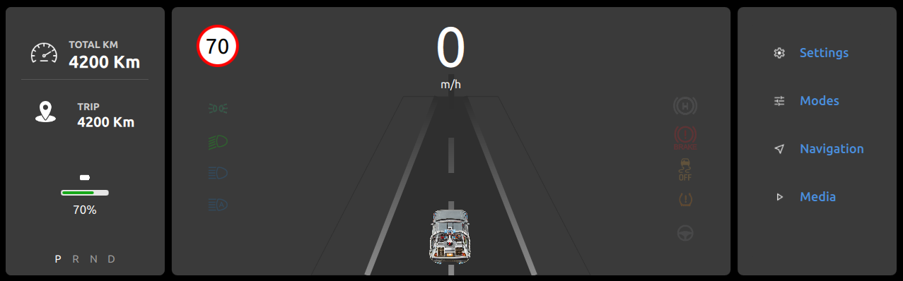
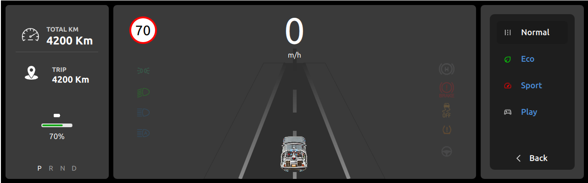
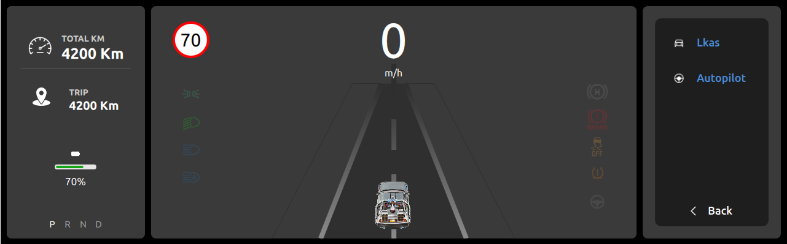
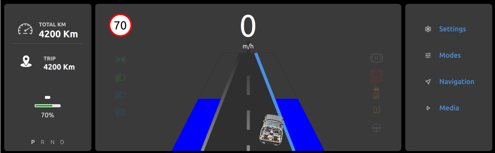
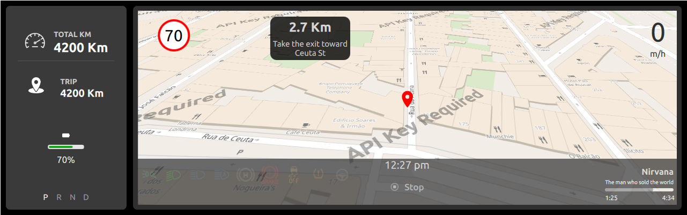
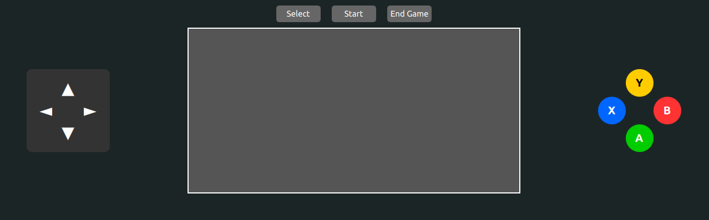
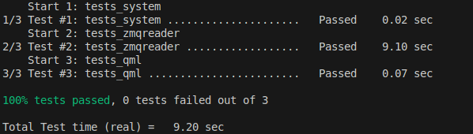
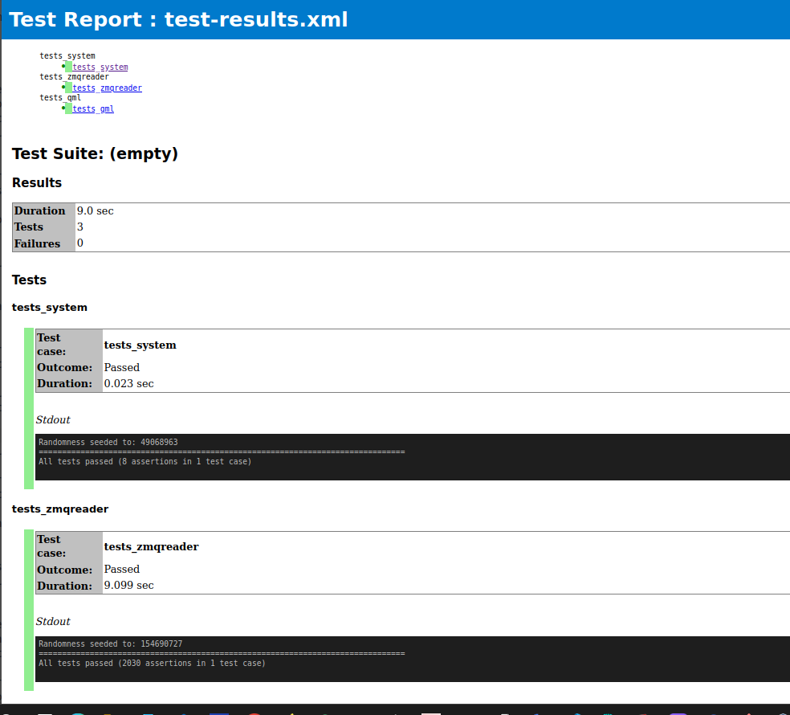
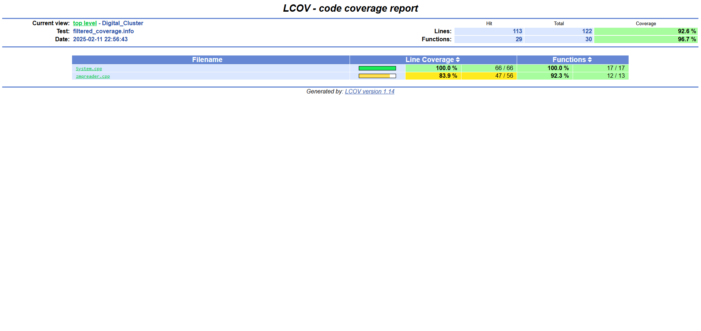

# Digital Cluster - Qt Automotive Interface


## Introduction

The Digital Cluster is a modern automotive interface designed to replace traditional analog dashboards with a sleek, digital solution. Built using Qt/QML, this project delivers a highly responsive and visually appealing user interface tailored for embedded automotive systems. By integrating real-time data through ZeroMQ, it ensures that critical vehicle information, navigation, and alerts are always up-to-date, enhancing both driver safety and experience. The following images showcase various aspects of the cluster’s interface, highlighting its versatility and functionality.

## Interface Previews

  
*Main interface of the digital cluster (example 1)*

  
*Main interface of the digital cluster (example 2)*

  
*Main interface of the digital cluster (example 3)*

  
*Alerts in main interface of the digital cluster (example 4)*

  
*Navigation interface of the digital cluster (example 5)*

  
*Play mode interface of the digital cluster (example 6)*

## Features

This digital cluster project, developed in Qt/QML with ZeroMQ for real-time data integration, includes the following key components:

- Left panel with vehicle information
- Right panel for settings, modes and navigation selection
- Navigation center with maps
- Media and telemetry controls
- Alert and diagnostics system

## Project Structure

```plaintext
Digital_Cluster/
├── main.cpp
├── Main.qml
├── System.cpp
├── System.h
├── zmqreader.cpp
├── zmqreader.h
├── ui/
│   ├── LeftPanel/       # Left panel (speedometer, gear info ...)
│   ├── CenterPanel/     # Navigation and main controls
│   |── assets/          # Icons and graphical resources
│   |── Main/            # Mainpage
│   └── Play/            # Play mode
└── tests/               # Unit and integration tests
```

## Requirements

- **Qt 6.5.3+** (Quick, QmlTools)
- **CMake 3.16+**
- **ZeroMQ 4.3.4+**
- **C++17 Compiler**
- **lcov** (for coverage reports)

## Build & Run

### On Raspberry Pi (ARM64)
```sh
mkdir build && cd build
cmake -DCMAKE_PREFIX_PATH=path/to/Qt6  -DQt6QmlTools_DIR=pat/to/Qt6QmlTools ..
make 
./appDigital_Cluster
```

### On Qt Creator
1. Open the main `CMakeLists.txt` file.
2. Configure a compatible kit (e.g., Qt 6.5.3 GCC).
3. Build (Ctrl+B) and Run (Ctrl+R).

## Testing & Coverage

### Running tests (Ubuntu)
```sh
cd tests/
mkdir build && cd build
cmake .. -DCMAKE_PREFIX_PATH=/path/to/Qt6
make

# Run individual tests
./tests_zmqreader -s   # ZMQ communication tests
./tests_system -s      # System core tests
./tests_qml -s         # QML integration tests
ctest -V			   # All tests
```


  
*Example of the tests report generated*


### Generating Code Test Report


```sh
ctest --output-junit test-results.xml # generate report

#install dependencies
pip install junit2html

#convert XML to HTML
/path/to/junit2html test-results.xml test-results.html

# Open the report
xdg-open test-results.html  # Linux
open test-results.html      # macOS
start test-results.html     # Windows
```

  
*Example of the tests report generated*


### Generating Code Coverage Report

[](
https://seame-pt.github.io/T07-DES_Instrument-Cluster/)


```sh
# Install dependencies
sudo apt-get install lcov gcc

# Capture coverage data
lcov --capture --directory . --output-file coverage.info

# Filter results
lcov --extract coverage.info "/path/to/Digital_Cluster/*" --output-file extracted.info
lcov --remove extracted.info "/path/to/Digital_Cluster/tests/*" --output-file filtered_coverage.info

# Generate HTML report
genhtml filtered_coverage.info --output-directory coverage_report

# Open the report
xdg-open coverage_report/index.html  # Linux
open coverage_report/index.html      # macOS
start coverage_report/index.html     # Windows
```

  
*Example of the coverage report generated by lcov*


## Documentation

[](./docs/refman.pdf)

The project documentation is generated using Doxygen, which provides a clear and structured overview of the codebase, class relationships, and module functionalities. It includes support for graphical diagrams via Graphviz and offers both HTML and PDF output formats for flexibility.

### Generating Documentation

```sh
#Install Required Tools (Ubuntu)
sudo apt update
sudo apt install doxygen graphviz

# Verify the installation:
doxygen --version
dot -V

```

### Generate HTML Documentation

```sh
# In the dir where the Doxyfile is located:
doxygen Doxyfile

#In de dir docs/html, open the main page with:
xdg-open docs/html/index.html  # Linux
open docs/html/index.html      # macOS
start docs/html/index.html     # Windows

```

### Generate PDF Documentation
```sh
# Install LaTeX dependencies:
sudo apt-get install -y texlive-latex-base texlive-latex-extra texlive-fonts-recommended

# Verify LaTeX is available:
pdflatex --version

#In the dir docs/latex/ compile the PDF:
cd docs/latex
make

```

This will generate refman.pdf, a comprehensive reference manual for the project.

---
### Technical Notes:
- **ZMQ communication** is set on **port 5555 (TCP)**.


Developed by: Team07 - SEA:ME Portugal  

[](https://github.com/orgs/SEAME-pt/teams/team07)

