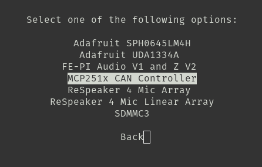

# CAN MCP2515 Configuration for Jetson vim

This guide provides step-by-step instructions to configure the MCP2515 CAN module on the Jetson vim.


## Edit Boot Configuration

1. Open the boot configuration file:
   ```sh
   sudo vim /boot/extlinux/extlinux.conf
   ```
2. Create a custom label by copying the `primary` label and adding the following line:
   ```
   FDT /boot/dtb/kernel_tegra210-p3448-0000-p3449-0000-b00.dtb
   ```
3. Change the default boot entry to `custom`

4. Ensure the final configuration resembles the following:
   ```
   TIMEOUT 30
   DEFAULT custom


   MENU TITLE L4T Boot Options

   LABEL primary
         MENU LABEL Primary Kernel
         LINUX /boot/Image
         INITRD /boot/initrd
         APPEND ${cbootargs} quiet root=/dev/mmcblk0p1 rw rootwait rootfstype=ext4 console=ttyS0,115200n8 console=tty0 fbcon=map:0 net.ifnames=0

   LABEL custom
         MENU LABEL Custom Kernel
         LINUX /boot/Image
         INITRD /boot/initrd
         FDT /boot/dtb/kernel_tegra210-p3448-0000-p3449-0000-b00.dtb
         APPEND ${cbootargs} quiet root=/dev/mmcblk0p1 rw rootwait rootfstype=ext4 console=ttyS0,115200n8 console=tty0 fbcon=map:0 net.ifnames=0
   ```

## Modify `board.py`

1. Open the Jetson board script:
   ```sh
   sudo vim /opt/nvidia/jetson-io/Jetson/board.py
   ```
2. Locate the function `_board_partition_is_mounted(partlabel)` and modify this line:
   ```python
   if partlabel == label:
   ```
   Change it to:
   ```python
   if partlabel == label and mount == '/':
   ```
3. Save and exit, then reboot:
   ```sh
   sudo reboot
   ```

## Modify `modules.conf`

1. Open the modules.conf:
   ```sh
   sudo vim /etc/modules-load.d/modules.conf
   ```
2. add and save:
   ```sh
    spidev
    can
    can_dev
    can_raw
   ```

## Enable SPI Interface

1. Run the Jetson IO script:
   ```sh
   sudo /opt/nvidia/jetson-io/jetson-io.py
   ```
2. Enable SPI following the provided UI instructions.

    

    

    

3. This will generate the file:
   ```
   /boot/kernel_tegra210-p3448-0000-p3449-0000-b00-user-custom.dtb
   ```

## Modify Device Tree Overlay

1. Power off the Jetson vim and insert the SD card into another computer.
    ```
    Why do this step on another computer?
    On the jetson vim the dtc version is old and cannot decompile dtbo files.
    ```
2. Navigate to the SD card boot directory and back up the existing DTBO file for safety:
   ```sh
   cp tegra210-p3448-0000-p3449-0000-a02-mcp251x.dtbo tegra210-p3448-0000-p3449-0000-a02-mcp251x.dtbo.bak
   ```
3. Decompile the device tree overlay:
   ```sh
   sudo dtc -I dtb -O dts -o tegra210-p3448-0000-p3449-0000-a02-mcp251x.dts tegra210-p3448-0000-p3449-0000-a02-mcp251x.dtbo
   ```
4. Modify the `can_clock` settings in `tegra210-p3448-0000-p3449-0000-a02-mcp251x.dts`:
   ```dts
   can_clock {
       compatible = "fixed-clock";
       #clock-cells = <0x00>;
       clock-frequency = <8000000>;
       clock-accuracy = <100>;
       linux,phandle = <0x01>;
       phandle = <0x01>;
   };
   ```
5. Recompile the DTBO:
   ```sh
   sudo dtc -I dts -O dtb -o tegra210-p3448-0000-p3449-0000-a02-mcp251x.dtbo tegra210-p3448-0000-p3449-0000-a02-mcp251x.dts
   ```
6. Delete other DTBO files related to MCP2515 and keep only the modified one (and the backup).
7. Reinsert the SD card into the Jetson vim and boot.

## Apply the overlay

1. Reopen the Jetson IO menu:
    ```sh
    sudo /opt/nvidia/jetson-io/jetson-io.py
    ```
2. Now configure by compatible hardware and choose MCP 251x CAN Controller:

    [jetson.io spi](imgs/img4.png)

    

    


## Configure Hardware Interrupts

1. Open the GPIO debug information:
   ```sh
   sudo cat /sys/kernel/debug/gpio
   ```
    

    In this output the first value gpio-XX is de irq, inside () are the functions

2. Find an available interrupt (IRQ). Default is IRQ 200 (GPIO11), but this may be in use. In my case i try on this irq:

    

    IRQ 38 - function gpio 13 - physical pin 33

3. Modify the device tree by decompiling:
   ```sh
   sudo dtc -I dtb -O dts -o kernel_tegra210-p3448-0000-p3449-0000-b00-user-custom.dts kernel_tegra210-p3448-0000-p3449-0000-b00-user-custom.dtb
   ```
4. Update the `interrupts` entry to use GPIO 38 (IRQ 38, physical pin 33):
   ```dts
   spi@0 {
       interrupts = <0x26 0x1>; # 0x26 in hex is 38 (our IRQ)
       interrupt-parent = <0x5b>;
       clocks = <0x131>;
       nvidia,rx-clk-tap-delay = <0x7>;
       nvidia,enable-hw-based-cs;
       status = "okay";
       compatible = "microchip,mcp2515";
       reg = <0x0>;
       spi-max-frequency = <0x989680>;

       controller-data {
           nvidia,tx-clk-tap-delay = <0x0>;
           nvidia,cs-hold-clk-count = <0x1e>;
           nvidia,cs-setup-clk-count = <0x1e>;
           nvidia,enable-hw-based-cs;
           nvidia,rx-clk-tap-delay = <0x1f>;
       };
   };
   ```
5. Recompile the DTB:
   ```sh
   sudo dtc -I dts -O dtb -o kernel_tegra210-p3448-0000-p3449-0000-b00-user-custom.dtb kernel_tegra210-p3448-0000-p3449-0000-b00-user-custom.dts
   ```

## Final Steps

1. Turn off the Jeston

2. Connect the connect the CAN device in correct pins, ensure the CAN INT pin is connected to GPIO 13 (pin 33) and Turn on the Jetson.
    

3. Verify CAN is recognized:
   ```sh
   dmesg | grep mcp
   ```
4. If no errors, bring up the CAN interface:
   ```sh
   sudo ip link set can0 type can bitrate 500000
   sudo ip link set can0 up
   ```
5. If testing with loopback mode:
   ```sh
   sudo ip link set can0 type can bitrate 500000 loopback on
   sudo ip link set can0 up
   candump can0 & cansend can0 123#DEADBEEF
   ```
6. If transmission fails, try a different IRQ by modifying the device tree again.

---

This guide ensures a stable CAN MCP2515 setup on the Jetson vim, avoiding conflicts and optimizing performance.

